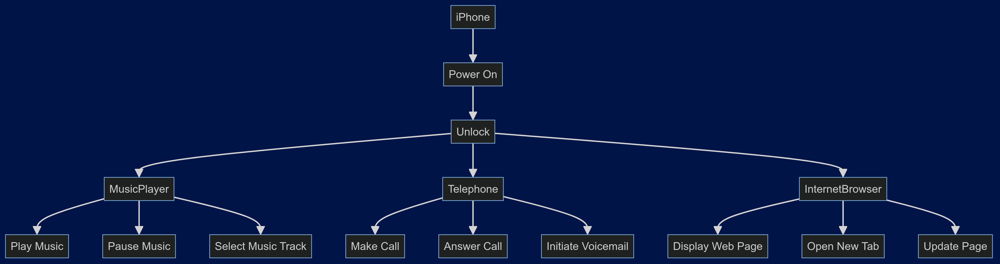

# Java Developer Formation Challenge at DIO: iPhone 2007

This project is part of the Java Developer training at DIO (Digital Innovation One), focused on modeling the functionalities of the 2007 iPhone launch through classes and interfaces.

## Objective

The goal of this project is to create a UML diagram that accurately represents the features of the 2007 iPhone launch, and subsequently implement these features using Java classes and interfaces.

### UML Diagram

Below is the UML diagram illustrating the structure and interactions of the iPhone and its core applications: Music Player, Telephone, and Internet Browser.

- 

### Implementation

Based on the UML diagram, the following Java classes have been implemented to simulate the functionalities of the iPhone 2007:

- **iPhone:** Manages the overall state and operations of the iPhone.
- **MusicPlayer:** Provides methods for playing, pausing, and selecting music tracks.
- **Telephone:** Supports functionalities such as making calls, answering calls, and managing voicemail.
- **InternetBrowser:** Allows browsing web pages, managing tabs, and updating content.

These classes aim to reflect the capabilities of the original iPhone released in 2007, providing a foundational understanding of its operational aspects through object-oriented programming in Java.

---

